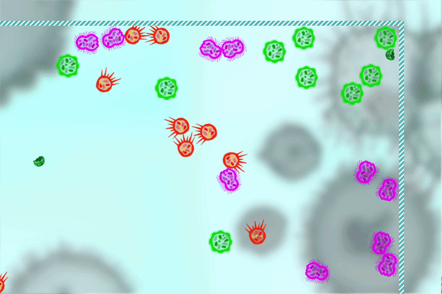

# Bacteriostat: The simple 2D representation of the Finite-State Machine (FSM) principle

The project created to approve hypotheses of the thesis using the [Godot](https://godotengine.org/) engine.

## Preview

## Ecosystem

Ecosystem contains a list of various entities in the limited space dynamic environment.

Entities:
* **Green**, **Purple** and **Orange** bacteria with distinct behavior patterns driven by the **FSM**.
* **Energy Cells** with implemented physics base and no behavior.

Static:
* Environment borders (colliders).

Time seasons:
* **Day** with a lot of sunlight
* **Night**. Dark and danger

## Controls
| Key | Description |
| --- | ----------- |
| WASD | Move user camera. |
| Mouse Scroll | - Camera zoom |
| Left Mouse Button | - Move object |
| Right Mouse Button | - Select object to check its properties. |
| Space | - Pause/play simulation physics. |
| 1 | - Turn off `DEBUG` mode. |
| 2 | - Turn on `DEBUG` mode (single mode). |
| 3 | - Turn on `DEBUG` mode (full mode). |

## Other

Thanks to **@JapanYoshi** for the `Motion Control` font.